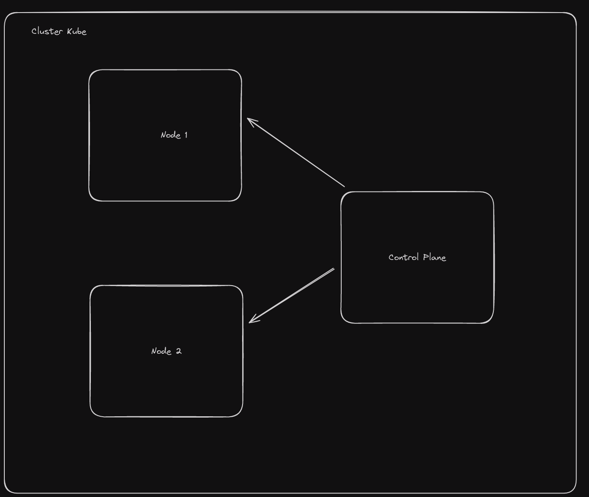
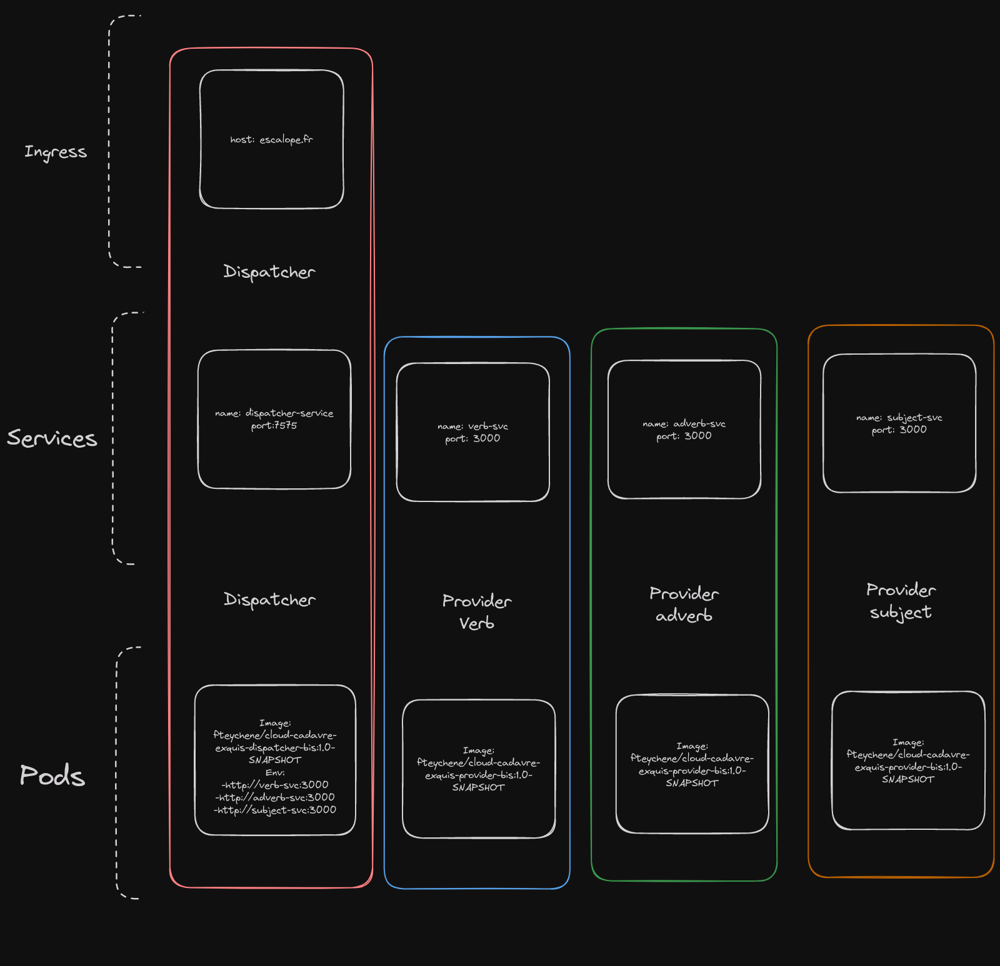

# Cadavera

This documentation has been written to be followed with eyes closed (almost). Try to not move any file in order to not corrupt the installation. This documentation should work for almost all linux distros. The setup requires to have root privileges.

This application has been created by Hugo PONTHIEU, Sarah THEOULLE and Thomas BROINE

### Requirements

To follow the installation you must have:

- Openstack accesses:

 1) [Configure OVH user](https://help.ovhcloud.com/csm/fr-public-cloud-compute-horizon?id=kb_article_view&sysparm_article=KB0050895)
 2) [Install openstack-client](https://help.ovhcloud.com/csm/fr-public-cloud-compute-prepare-openstack-api-environment?id=kb_article_view&sysparm_article=KB0050995)
 3) [Provide env variable](https://help.ovhcloud.com/csm/fr-public-cloud-compute-set-openstack-environment-variables?id=kb_article_view&sysparm_article=KB0050935)

- [Terraform](https://developer.hashicorp.com/terraform/install)
- [Ansible](https://docs.ansible.com/ansible/latest/installation_guide/intro_installation.html)
- [Kubectl](https://kubernetes.io/docs/tasks/tools/)
- Having an ssh key ed25519 ready to be used

First of all clone the project:

```bash
git clone git@github.com:hugoponthieu/cadavera-clean.git
```

Enter the project:

```bash
cd cadavera-clean
```

If you fill requirements you should have download the `openrc.sh`
Source the file openrc.sh file in the terminal:

```bash
source path/to/openrc.sh
```

## Provide infrastructure

Then let's setup the infrastructure:

```bash
cd instance
```

Once the configuration is done you should fill `main.tf`
You must provide:

- Path to a local ssh key
- Its name (choose anything you want)
- Gather application key , application secret and consumers key from [here](https://www.ovh.com/auth/api/createToken?GET=/*&POST=/*&PUT=/*&DELETE=/*)

```yaml
module "upServer" {
  source             = "./upServer"
  name_sshkey        = "Name you want to key to take in your ovh account"
  file_sshkey        = "Path to a local public key"
  application_key    = "Generate app key"
  application_secret = "Generate app secret"
  consumer_key       = "Generate consumer key"
  instances          = var.instances
}
```

You can change the name of the instances you will be creating. The list of names is in the file variable.tf

As you are in the file  `` instance/ ``  you can now run:

```bash
terraform init
```

Then:

```bash
terraform apply
```

If everything went as planned you should have this at the end of the execution:

```
Apply complete! Resources: 7 added, 0 changed, 0 destroyed.
```

You just created multiple virtual machines ready to accept your Kubernetes cluster.

## Create Kubernetes cluster

You can now enter:

```bash
cd ../k3s-ansible
```

Then run:

```bash
ansible-playbook playbook/site.yml -i inventory
```

After a lot of logs (too much) your cluster should be setup and functional.
Your cluster is made of 3 differents machines, one mastering the two others. They are replicated to ensure no data is lost in case of failure.

Let's now provide an access to this cluster.

## Setup the access

It's time to configure the freshly created instance. You can run:

```bash
cd ../setup
```

Launch the Ansible playbook with:

```bash
ansible-playbook -i inventory kubeconfig-provider.yaml
```

You can now run to finish the setup:

```bash
./setup_local.sh
```

You are now entering the last part of the documentation. You should be able to use the cadavre exquis very soon (almost).

## Deploy the app

```bash
cd ../appYAML
```

Everything is now setup to access the Kubernetes cluster you've juste build. You can launch the configuration with:

```bash
kubectl apply --kubeconfig=k3s.yaml -f . 
```

## Acces the app

In your favorite browser enter _escalope.fr_ and watch the magic unfold as the app is up and running. you can click the button to create a new sentence as you wish.


## What have you done ?? 

In the first section you deployed with Terraform 3 OVH instances. Then with Ansible you setup a Kubernetes cluster with one server (control plane) node and two agent nodes (node 1, node 2) .This simple graph sum it simply:



We choose to use the provided Ansible provided by k3s  to setup the cluster. We could have chosen to deploy more server nodes for higher availability but the goal here was really for us to explore multi-cluster.

Once that was done you applied with Kubectl a classic cluster infrastructure that look like this:


